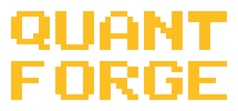

# QuantForge

English | [中文](README.zh.md)

<p align="center">
  
</p>


QuantForge is a Python-first, multi-asset quantitative research and trading
platform that uniformly supports:

- US equities with live Charles Schwab connectivity
- US equity option chains, single-leg and 2–4 leg combo orders, expiries and assignment
- Crypto spot and perpetual/futures (CCXT)
- Python strategy backtesting, parameter optimization, paper and live execution
- Non-bypassable global order risk control

Strategy source code is code-reviewed and version-managed. The web UI only
offers strategy selection, parameters, risk configuration, backtesting, and
run control — never online code editing.

## Quick start

```bash
uv sync
uv run pytest -q
uv run quantforge-cli strategies list
uv run quantforge-cli web start
```

Frontend:

```bash
cd apps/dashboard/frontend
npm install
npm run build
```

## Core layout

```text
quantforge/
  strategy/       Python strategy API, registry, bars and indicators
  strategies/     built-in technical strategies and TSLA/NVDA option management strategies
  backtest/       shared backtesting engine
  domain/         stocks, options, crypto assets and order intents
  portfolio/      unified ledger
  risk/           enforced risk boundaries
  execution/      the only order execution service
  adapters/       Schwab, CCXT and market-data adapters
  options/        pricing, lifecycle and option-management rules
  brokers/        broker clients
```

The canonical execution path is:

```text
Python Strategy → Canonical Order Intent → RiskEngine
                → ExecutionService → Schwab / CCXT / Paper
```

## Data and backtest marks

Equity and crypto backtests use historical OHLCV for the respective market.
The live Schwab option chain is used for real-time analysis; historical option
research approximates prices with underlying price and volatility models and
is explicitly marked `approximate_unvalidated` — never treated as historical NBBO.

## Live engines

- Bar live engines decide on the last closed bar and submit immediately with
  MARKET orders; they prefer real market quotes (Schwab bid/ask, CCXT ticker)
  to drive spread and quote-age risk checks, falling back to a bar-close
  approximation only when quotes are unavailable.
- Engines use a "watchdog" exit strategy: silent loops (e.g. a hung feed)
  auto-restart with backoff (max 3, counter resets after healthy runs); beyond
  budget or on build failure they are marked `failed` and wait for human
  intervention; deterministic exceptions (e.g. risk rejection) never auto-restart.
- A single-instance file lock prevents two Dashboard processes from placing
  orders at once; all engines share the daily new-position counter
  (`~/.quantforge/risk/daily-entries.json`), which survives restarts.

## Job persistence

The backtest/optimize job registry persists to `~/.quantforge/jobs/registry.json`
by default. With `QUANTFORGE_REDIS_HOST` (or `QUANTFORGE_REDIS_URL`) set and
the `redis` package installed, the registry switches to Redis, falling back to
the file backend automatically when Redis is unavailable. Two ways to run a
local Redis:

- With Docker: `docker compose up redis`.
- Without root (already installed on this machine; use `scripts/dev-redis.sh start`):
  the project provides a no-root Redis build from official sources into
  `~/.quantforge/redis` (compiled on this machine). Start/stop:
  ```bash
  scripts/dev-redis.sh start     # start 127.0.0.1:6379 (daemon, pidfile managed)
  scripts/dev-redis.sh status
  scripts/dev-redis.sh stop
  ```

The PostgreSQL service in `docker-compose.yml` has no application consumer yet
(no code reads or writes it).

## Security

Secrets live only in `.keys/.secrets.toml` or the restricted user token store;
never commit them to Git. Live orders do not need per-order human confirmation
but must pass hard checks for notional, leverage, spread, quote age, naked
options, and daily new-position limits.

The Dashboard backend binds to `127.0.0.1` by default (see `apps/dashboard/start.sh`).
To expose it to the network you must explicitly pass `--host 0.0.0.0` and set
the `QUANTFORGE_API_KEY` environment variable — every `/api*` request then needs
the `X-API-Key` header (WebSockets use the `?api_key=` query parameter). The
script refuses to start on a non-loopback address without the key.

## Multi-asset research layer

`apps/research/` is the data layer: a DuckDB warehouse (`data/market.duckdb`),
equity event/proxy research, and daily multi-asset reports for crypto, option
chains, and price/technical screens. It ships with a unified CLI
(`python -m apps.research <command>`), a daily systemd timer
(`research-daily.timer`), and optional email delivery of the daily reports.
See the operations manual at `.agents/skills/quantforge-research/SKILL.md` and
the evidence base at `apps/research/KNOWLEDGE.md`.

